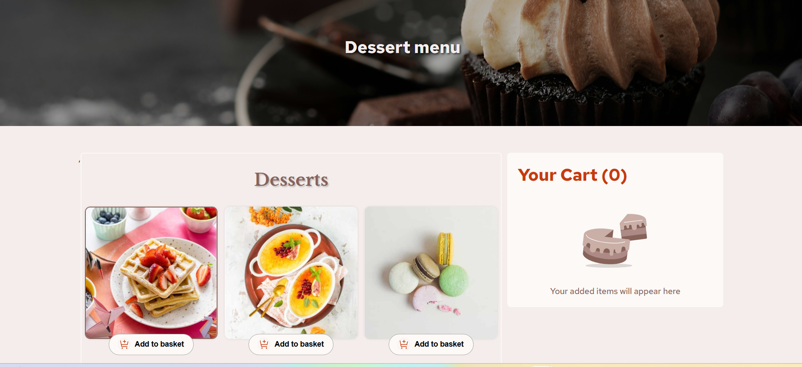

🍰 Dessert App

This is a Dessert Web Application built with React and SCSS (BEM methodology).
The app allows users to browse desserts, add them to a cart using the keyboard or mouse, manage their cart contents, and confirm their order. After confirmation, a popup window is displayed with the full order summary and total price.
The project simulates data loading with a loader component and uses a local JSON file as the data source.

🌍 Live Demo

Check out the live version of the app here: https://lustrous-kangaroo-3d4281.netlify.app/

📸 Preview

Here’s a preview of the Dessert App: 

📌 Features

✅ Browse Desserts – view a list of available desserts dynamically loaded from a JSON file.

✅ Simulated Loading – initial loading animation while fetching data.

✅ Keyboard Navigation – navigate through desserts using arrow keys and add to cart using Enter.

✅ Add to Cart – add desserts to the shopping cart via mouse or keyboard.

✅ Remove Items – decrease quantity or remove desserts entirely from the cart.

✅ Cart Management – view, edit, and confirm cart items.

✅ Popup Order Confirmation – display a confirmation modal with the final order and total price.

✅ Responsive Layout – works smoothly on desktop, tablet, and mobile devices.

✅ SCSS with BEM – structured and maintainable styling.

🛠️ Tech Stack

React – UI library for building components.

SCSS – styling with BEM methodology for clean, scalable CSS.

JavaScript (ES6+) – app logic and interactivity.

JSON Data – simulating an API using local JSON data.

Netlify – hosting and deployment platform.

🚀 Installation & Setup

Clone the repository:

git clone https://github.com/your-username/Dessert-App.git
cd Dessert-App

Install dependencies:

npm install

Start the development server:

npm start

Open http://localhost:3000
 in your browser to view the project.

📜 Available Scripts

npm start – Runs the app in development mode.

npm test – Launches the test runner.

npm run build – Builds the app for production.

npm run eject – Removes Create React App configuration for full customization.

📚 What I Learned

This project helped me improve my skills in:

🎯 React State Management – handling cart items, popup states, and navigation index.

🎯 Keyboard Accessibility – adding support for keyboard navigation and actions like adding to cart or confirming orders.

🎯 Loading Simulation – using a loader to create a smooth user experience while fetching data.

🎯 SCSS with BEM – writing clean, scalable, and maintainable styles.

🎯 Responsive Design – ensuring usability across multiple screen sizes.

🎯 Popup Management – handling modals dynamically with visibility toggles and resets.

🎯 Dynamic Data Handling – loading desserts from JSON and simulating API behavior.

📬 Contact

If you have any questions or suggestions, feel free to reach out:

GitHub: Konrad2502

Email: konrad.litak@gmail.com